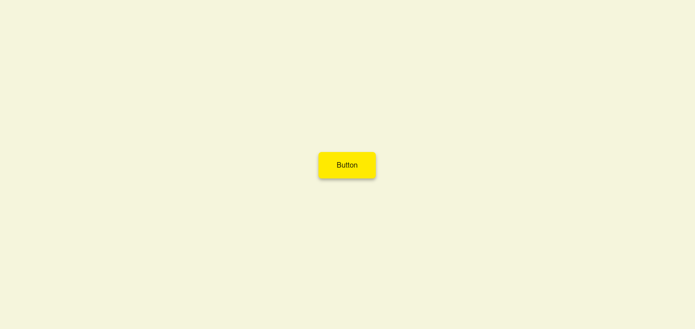

# Button Ripple Effect

### Visit The Live Website   [Button Ripple Effect](https://devtripathy.github.io/Button-Repple-Effect/)

  This is a button that shows a ripple effect when the user hoover over it. The interesting thing regarding the button is **the ripple effect starts from the place where the cursor touches the button.**


## Language Used :-
> HTML

> CSS

> JavaScript




## Learned Concepts :-

- Eventlistener (mouseover event)

- The "before" & "after" pseudo classes are not accessible through the javaScript DOM. Inorder to make them accessible in JS, we can store the value of the specific property (of a pseudo class) inside a CSS variable.

#### Example :

##### CSS
```
.btn::before{
    top: var(--yPos);
    left: var(--xPos);
}
```
JS
```
const btnEl = document.querySelector(".btn");

btnEl.style.setProperty("--xPos", x + "px");
btnEl.style.setProperty("--yPos", y + "px");
```
